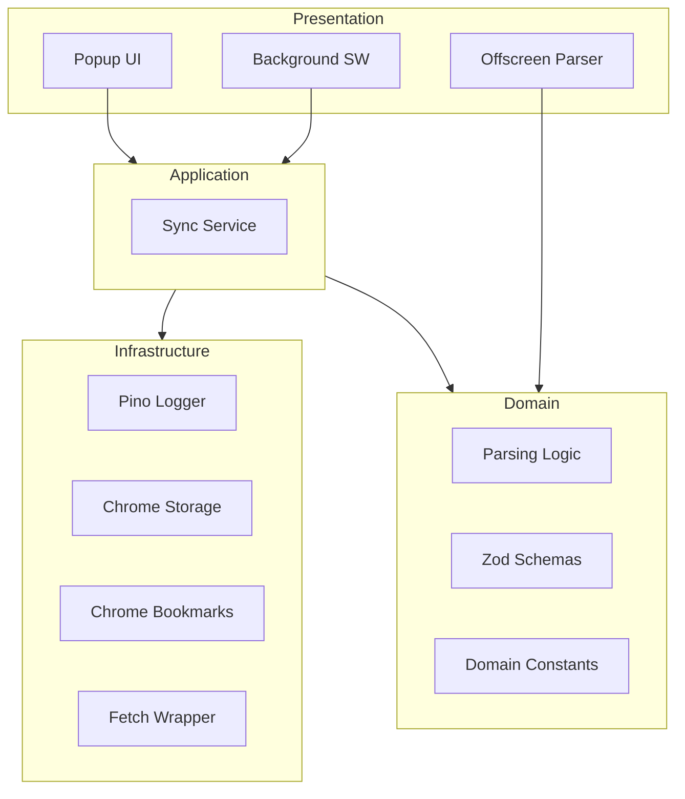

# FMHY Sync

An automated tool to sync the [FMHY starred bookmarks](https://github.com/fmhy/bookmarks) directly into your browser bookmarks bar, neatly categorized.

## Architecture (Hexagonal)

## Scripts Guide

This project follows a high-performance, strictly typed workflow.

- `npm run dev`: Build in watch mode using `esbuild`.
- `npm run build`: Production bundle and asset copying.
- `npm run lint`: Linting using `oxlint`.
- `npm run format`: Code formatting using `prettier` with `oxlint` plugin.
- `npm run type-check`: Strict type checking with `tsc`.
- `npm run test`: Run unit tests with `vitest`.
- `npm run check`: Run the full verification suite (format, lint, type-check, test).
- `npm run save`: Run `check` and commit changes if successful.

## Project Status

- **Type Safety**: Adheres to `@tsconfig/strictest`.
- **Validation**: Runtime validation powered by `zod`.
- **Tooling**: `esbuild`, `oxlint`, `prettier`, `vitest`.
- **Observability**: Structured logging with `pino` and correlation IDs.
